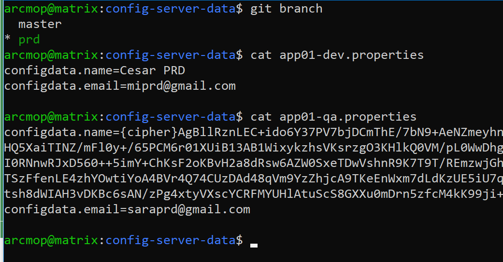
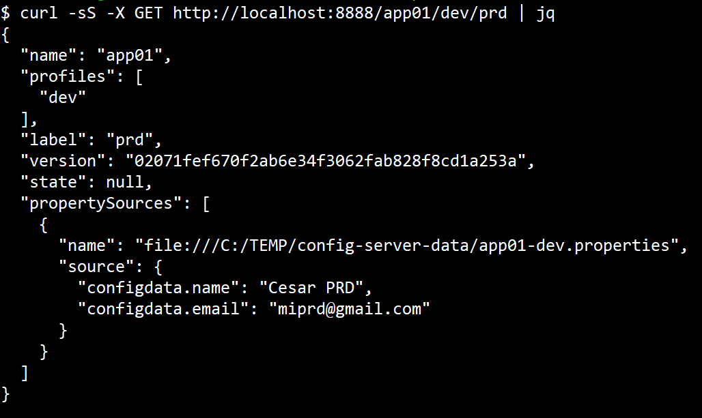
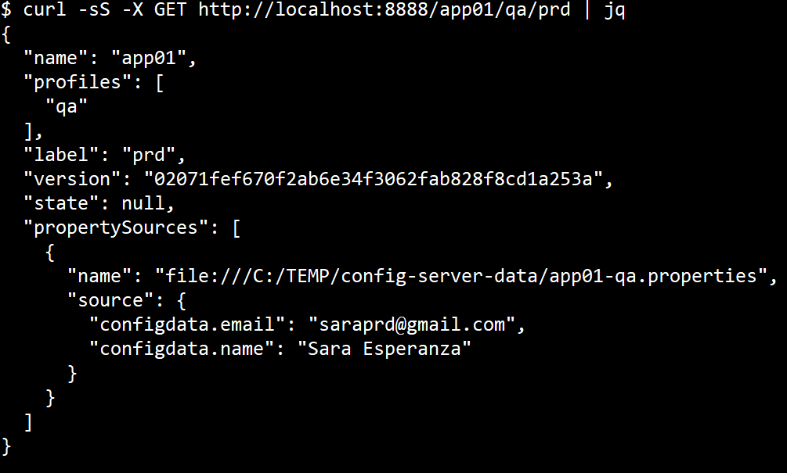

# Ejemplo de Config Server básico

## Comentarios

**@EnableConfigServer**: Sirve para indicar que la aplicación se configurará como un servidor de configuración.

**spring.cloud.config.server.git.default-label=master**: Se debe colocar para evitar el warning debido a que ahora git utiliza **main** como rama principal en lugar de **master**

Ejemplos de URL:

http://localhost:8888/{nombre_archivo}/{profile}/{label}

http://localhost:8888/app01/dev,qa/master


Los recursos se parametrizan mediante tres variables:

- {application}, que debe mapearse con el valor de **spring.application.name** on the **client** side.

- {profile}, , que debe mapearse con el valor de **spring.profiles.active** on the **client** (comma-separated list).

- {label}, que debe mapearse con algun tag, branch, commit en el servidor git en entornos "versionados" de archivos de configuración.

References:
- [spring_cloud_config_server](https://docs.spring.io/spring-cloud-config/docs/current/reference/html/#_spring_cloud_config_server)
- [application-properties](https://docs.spring.io/spring-boot/docs/current/reference/html/application-properties.html)

## Configuracion

```java

spring.application.name = configserver
server.port=8888
spring.cloud.config.server.git.uri = file:///C:/TEMP/config-server-data
spring.cloud.config.server.git.default-label=master

```

Muestro una imagen de la carpeta con el cotenido:



## Compilacion

```sh
source .env

JAVA_HOME=$JDK17 ./mvnw spring-boot:run
JAVA_HOME=$JDK17 ./mvnw clean package
java17 -jar target/configserver-0.0.1-SNAPSHOT.jar

```

## Agregando capacidades de encrypt/decrypt usando pem
```sh 
alias keytool=$JDK17/bin/keytool.exe

keytool -genkeypair -alias config-server-key \
        -keyalg RSA -keysize 4096 -sigalg SHA512withRSA \
        -dname 'CN=Config Server,OU=Spring Cloud,O=Arcmop' \
        -keystore config-server.jks \
        -storepass mystore654123 \
        -keypass mykey985632 \
        -validity 365000
       
Warning:  Different store and key passwords not supported for PKCS12 KeyStores. Ignoring user-specified -keypass value.
Generating 4,096 bit RSA key pair and self-signed certificate (SHA512withRSA) with a validity of 90 days
        for: CN=Config Server, OU=Spring Cloud, O=Arcmop

```
Como el mensaje menciona, se ignora el parametro **keypass** y solo se utiliza **storepass** con el valor de **mystore654123**

#### Usando application.properties

Puede configurarse así:

```properties
#encrypt.keyStore.location=classpath:/config-server.jks
encrypt.keyStore.location=file:///C:/TEMP/config-server-keys/config-server.jks
encrypt.keyStore.password=mystore654123
encrypt.keyStore.alias=config-server-key
encrypt.keyStore.secret=mystore654123
```

#### Usando bootstrap.yml

a)  Puede configurarse así:

```yaml
encrypt:
  keyStore:
    location: file:///C:/TEMP/config-server-keys/config-server.jks
    password: mystore654123
    alias: config-server-key
    secret: mystore654123
```

Con configuración externalizada, leyendo variables de entorno, esto es pensando en contenedores

```yaml
encrypt:
  keyStore:
    location: ${KEYSTORE_DB}
    alias: ${KEYSTORE_ALIAS}
    password: ${KEYSTORE_PWD}
    secret: ${KEYSTORE_PWD}
```

b) Agregar **spring-cloud-starter-bootstrap** esta dependencia al pom

```xml
<dependency>
	<groupId>org.springframework.cloud</groupId>
	<artifactId>spring-cloud-starter-bootstrap</artifactId>
</dependency>
```

### Encriptar datos

```sh
curl localhost:8888/encrypt -d 'dato' 

curl localhost:8888/decrypt -d '122XXXXXXXXXXXXXXXXXXXXXXXXXXXXXXXXXas' 

```

### Probar

Se debe esperar una salida similar a:


